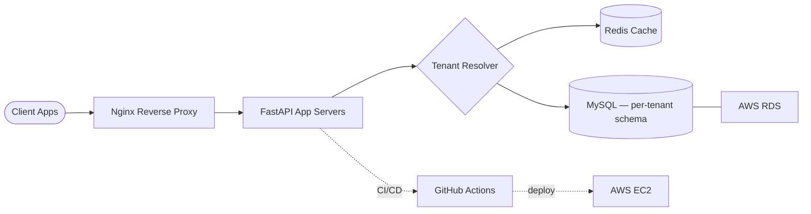
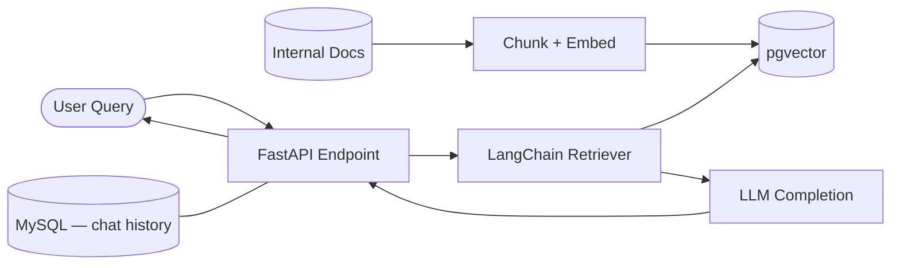
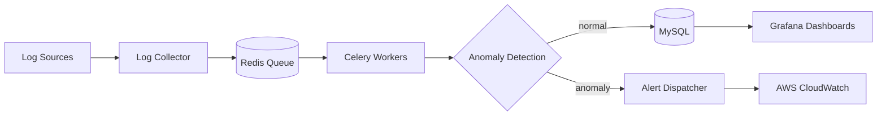

<div align="center">



<p>
  <a href="https://www.linkedin.com/in/sunilreddy-softwarengineer/"></a>
  <a href="mailto:sunilsoftwarengineer@gmail.com"></a>
  <a href="https://leetcode.com/u/Sunilsoftwarengineer/"></a>
</p>

📍 Bengaluru, Karnataka &nbsp;•&nbsp; 🟢 Immediate Joiner &nbsp;•&nbsp; ✈️ Open to relocate (Hyderabad)

</div>

<br>

## 📡 Live Stats
*Not a static badge — this table is regenerated daily by [`scripts/update_readme.py`](./scripts/update_readme.py) via [`.github/workflows/update-readme.yml`](./.github/workflows/update-readme.yml), pulling real numbers from the GitHub API.*

<!-- LIVE-STATS:START -->
| Metric | Value |
|---|---|
| Public repos | 3 |
| Total stars earned | 0 |
| Total forks | 0 |
| Most-used language | Dockerfile |

<sub>Auto-updated 2026-09-01 03:04 UTC by `scripts/update_readme.py`</sub>
<!-- LIVE-STATS:END -->

<br>

## 🖥️ `~/whoami`

```python
class PythonSoftwareEngineer:
    def __init__(self):
        self.name = "Sunil Kumar Reddy"
        self.role = "Python Software Engineer"
        self.location = "Bengaluru, India"
        self.core_stack = ["Python", "FastAPI", "SQLAlchemy", "Celery", "LangChain", "AWS"]
        self.believes = "Boring, observable systems beat clever, fragile ones."
        self.currently = ["Scaling RAG pipelines", "Vector search with pgvector", "AIOps tooling"]

    def say_hi(self) -> str:
        return "Thanks for stopping by — let's build something reliable."


if __name__ == "__main__":
    print(PythonSoftwareEngineer().say_hi())
```

<br>

## 🛠️ Tech Arsenal

<div align="center">


</div>

<table>
<tr><td><b>Languages & Core</b></td><td>


</td></tr>
<tr><td><b>Frameworks</b></td><td>


</td></tr>
<tr><td><b>Databases</b></td><td>


</td></tr>
<tr><td><b>Cloud & DevOps</b></td><td>


</td></tr>
<tr><td><b>Testing & CI/CD</b></td><td>


-000000?style=flat-square)

</td></tr>
<tr><td><b>Tools</b></td><td>


</td></tr>
</table>

<br>

## 🚀 Featured Projects — with system design

<details>
<summary><b>🏗️ Multi-Tenant SaaS API Platform</b> <sub>· Jan 2024 – Apr 2024</sub></summary>
<br>

`Python` `FastAPI` `MySQL` `Redis` `Docker` `Nginx` `AWS (EC2, RDS)` `GitHub Actions`

A backend platform serving isolated tenant workloads through a shared API layer — tenant resolution, connection pooling, and caching handled centrally.



**Engineering focus:** request-scoped tenant isolation, cache-aside pattern with Redis, zero-downtime deploys via GitHub Actions → EC2.

</details>

<details>
<summary><b>🧠 AI-Powered Enterprise Knowledge Assistant (RAG)</b> <sub>· May 2024 – Aug 2024</sub></summary>
<br>

`Python` `FastAPI` `LangChain` `pgvector` `MySQL` `AWS EC2` `Docker`

A retrieval-augmented assistant that answers questions grounded in internal company documents.



**Engineering focus:** chunking strategy for retrieval quality, vector similarity search at scale, responses traceable back to source documents.

</details>

<details>
<summary><b>📈 AIOps Log Anomaly Detection & Alerting System</b> <sub>· Sep 2024 – Dec 2024</sub></summary>
<br>

`Python` `Celery` `Redis` `MySQL` `Docker` `Grafana` `AWS CloudWatch`

A background pipeline that ingests application logs, flags statistical anomalies, and pushes alerts before they become incidents.



**Engineering focus:** async task orchestration with Celery, alert-fatigue reduction via thresholding, real-time observability in Grafana.

</details>

<br>

## 🎓 Education

```
MCA — Maharaja Agrasen Himalayan Garhwal University  (2021–2023)  |  GPA 8.0/10
BCA — Maharaja Agrasen Himalayan Garhwal University  (2019–2021)  |  GPA 7.55/10
```

<br>

## 📊 GitHub & LeetCode

<div align="center">


</div>

<br>

## 📈 Currently Exploring

```
Focus for 2026
├── 🤖 LLM-powered backends with LangChain
├── 🔎 Vector search at scale (pgvector)
├── ⚙️  Performance & load testing with Locust
└── ☁️  Deeper AWS infra: EC2, SQS, CloudWatch
```

<br>

<div align="center">


</div>
